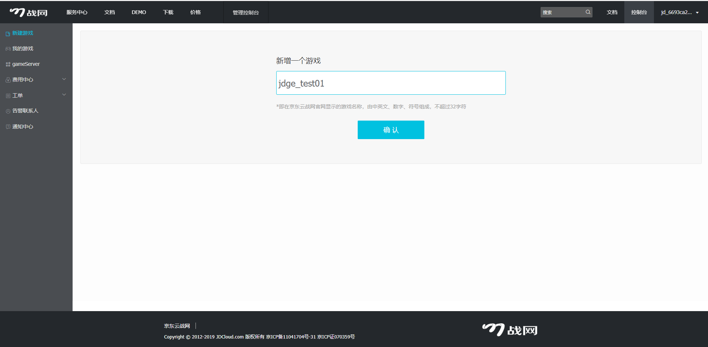
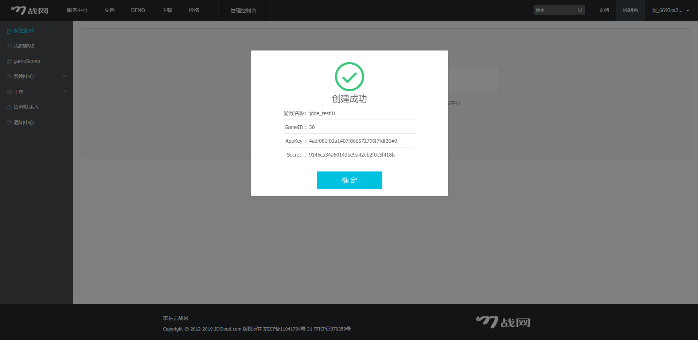

## Demo简介

为了便于开发者使用和理解，用 jdge 的实时联网 SDK 和 白鹭 `Egret` 开发的多人抢足球，提供了简洁的Demo来展示多人实时联网游戏的开发过程和效果，用于演示多人匹配、数据传输、帧同步、创建房间、获取房间列表、消息订阅、断线重连、修改房间属性等功能。jdge。

## 目录

````
┌─── matchvs 支持 Egret SDK库文件
├─── MatchvsDemo_Egret Demo 工程
└─── README.md
````


## Demo下载和体验

Demo 支持使用 jdge云和独立部署两种配置模式。

- [官网](http://home-ge.matrix.jdcloud.com/serviceDownload)
- [直接体验连接](http://demo-ge.matrix.jdcloud.com/Egret/)

> **注意**：下载Demo源码后，需要使用Egret的Wing打开工程(Wing建议使用4.1.0以上的版本，Egret引擎建议使用5.1.5以上版本)。满三人才可以开始游戏，使用三个不同的浏览器运行。Demo支持三人同时游戏，匹配成功后，玩家通过按住按钮左右滑动来推动小鸭子向左向右移动抢足球。

## Demo 使用jdge云配置

Demo运行之前需要去 [jdge 官网](http://home-ge.matrix.jdcloud.com/) 配置游戏相关信息，以获取Demo运行所需要的GameID、AppKey、SecretID。如图：



创建成功



修改 Demo 里  GameData.ts 的游戏配置信息为你自己的游戏信息，并确保 CHANNEL 为 jdge 或者 jdge , ENVIRONMENT 是在Demo登录界面环境选择的配置 确保配置信息为 `{ "dev": "alpha", "pro": "release" }` ，其中alpha 一般用于测试环境，release 用于生产环境。修改参数可参考下图：


如果不了解Login这个函数的参数请到官网查看相关的 [API接口说明](http://home-ge.matrix.jdcloud.com/service?page=APIUnity) 文档。

> 注意： 如果运行不成功请查看 egretProperties.json 文件是否配置了加了如下配置：
>
> ```
> { 
>     "name": "matchvs",
>     "path": "../matchvs"
> }
> ```


把游戏信息配置好就可以运行试玩，Demo运行界面如下，可以点击随机匹配开始：


## jdge SDK 引入

为了使demo游戏逻辑处理和 jdge sdk 模块划分更加明显，我们把 jdge SDK 使用封装在 /src/matchvs 目录下。通过事件触发的机制重新转发 jdge SDK 联网数据。/src/matchvs 目录下结构：

```
MsEngine.ts	: MatchvsEngine 实例对象的单例类型
MsEvent.ts 	：事件定义
MsResponse.ts ：MatchvsResponse 实例对象的单例类型
```

MsEngine.ts 文件构建了 jdgeEngine 的实例，对 jdge 的接口调用全部在这个类型中，示例代码如下：

```typescript
module mvs {
	/**
	 * 这个是 jdge 引擎 接口封装模块，对引擎的所有请求接口进行了二次封装，一些接口调用的参数可以在这里组合，所有对mathvs接口请求都在这里
	 */
	export class MsEngine {
		private static _instance = null;
		private _engine:MatchvsEngine = null; //MatchvsEngine 引擎
		public constructor() {
            //给这个类获取 MatchvsEngine 实例
			this._engine = new MatchvsEngine();
		}

		/**
		 * 获取类实例
		 */
		public static get getInstance():MsEngine{
			if(MsEngine._instance == null){
				MsEngine._instance = new MsEngine();
			}
			return MsEngine._instance;
		}
	}
}
```

MsResponse.ts 对 MatchvsResponse 回调接口 进行封装，使用 事件触发的机制 对消息进行处理，调用者只需要在使用的时候接受该事件消息，然后释放即可。

```typescript
module mvs {
	export class MsResponse extends egret.EventDispatcher{
		private static _instance:MsResponse = null;
		private _response:MatchvsResponse = null; //jdge 引擎
		public constructor() {
			super();
			this.registResponseCall();
		}
		/**
		 * 获取实例
		 */
		public static get getInstance():MsResponse{
			if(MsResponse._instance == null){
				MsResponse._instance = new MsResponse();
			}
			return MsResponse._instance;
		}
        /**
		 * MatchvsResponse 接口回调的重新注册
		 */
		private registResponseCall(){
			this._response = new MatchvsResponse();
			this._response.initResponse = this.initResponse.bind(this);
			this._response.registerUserResponse = this.registerUserResponse.bind(this);
			this._response.loginResponse = this.loginResponse.bind(this);
			this._response.joinRoomResponse = this.joinRoomResponse.bind(this);
			this._response.joinRoomNotify = this.joinRoomNotify.bind(this);
            ....
        }
    }
}
```


## 初始化SDK

首先要先初始化，设置好请求回调类型，和一些游戏信息。初始化示例代码如下：

#### MsEngine.ts 和 MsResponse.ts 文件定义

```typescript
//MsEngine.ts 请求
public init(channel:string, platform:string, gameID:number):number{
    this._response = MsResponse.getInstance.getResponse();
    let res = this._engine.init(MsResponse.getInstance.getResponse(),channel,platform,gameID);
    if (res !== 200){
        console.info("[MsEngine init failed] resCode:",res);
        return res;
    }
    console.info("[MsEngine init seccess] resCode:",res);
    return res;
}

//MsResponse.ts 回调
private initResponse(status:number){
    console.info("initResponse status：",status);
    this.dispatchEvent(new egret.Event(MsEvent.EVENT_INIT_RSP,false,false,{status:status}));
}


```

#### 使用示例

```typescript

//LoginView.ts
 button.addEventListener(egret.TouchEvent.TOUCH_TAP, e => {
     GameData.configEnvir(input.text, cbx.selected);
     console.log(" environment=" + GameData.DEFAULT_ENV + " gameid=" + GameData.gameID);
     //这里调用 MsEngine.ts 中的函数     
     let result = mvs.MsEngine.getInstance.init(GameData.CHANNEL, GameData.DEFAULT_ENV, GameData.gameID);
        }, this);


//LoginView.ts 在页面用户监听到的回调事件
private initResponse(ev:egret.Event) {
    console.log("initResponse,status:" + ev.data.status);
    ...
}
```

**注意** 在整个应用全局，开发者只需要对引擎做一次初始化。


## 注册用户

接下来，我们就可以从jdge获取一个合法的用户ID，通过该ID连接至jdge服务端。这个用户ID每次获取的都是不同的，如果需要固定的用户ID参考 [第三方绑定](http://doc-ge.matrix.jdcloud.com/Advanced/ThirdAccount)

#### MsEngine.ts 和 MsResponse.ts 文件定义

```typescript
//MsEngine.ts
public registerUser():number{
    //这里调用注册用户接口
    let res = this._engine.registerUser();
    if (res !== 0){
        console.error("[MsEngine registerUser failed] resCode:",res);
        return res;
    }
    console.info("[MsEngine registerUser seccess] resCode:",res);
    return res;
}

//MsResponse.ts 注册回调
private registerUserResponse(userInfo:MsRegistRsp){
    console.info("registerUserResponse userInfo ",JSON.stringify(userInfo));
    this.dispatchEvent(new egret.Event(MsEvent.EVENT_REGISTERUSER_RSP,false,false,userInfo));
}
```

#### 使用示例

```typescript
//LoginView.ts
mvs.MsResponse.getInstance.addEventListener(mvs.MsEvent.EVENT_REGISTERUSER_RSP, this.registerUserResponse, this);


 private initResponse(ev:egret.Event) {
     ......
     //获取微信信息失败，注册游客身份登录
     console.info("获取信息失败：",res);
     mvs.MsEngine.getInstance.registerUser();
 }

private registerUserResponse(ev:egret.Event) {
    let userInfo = ev.data;
    GameData.gameUser.id = userInfo.userID;
    GameData.gameUser.name = userInfo.name;
    GameData.gameUser.avatar = userInfo.avatar;
    GameData.gameUser.token = userInfo.token;
    .....
}

```

## 登录

获取到有效用户ID就可以登录到 jdge 联网服务

#### MsEngine.ts 和 MsResponse.ts 文件定义

```typescript
// MsEngine.ts 登录请求
public login(userID:number, token:string, gameID:number, appkey:string, secretkey:string):number{
    let res = this._engine.login(userID,token,gameID,1,appkey,secretkey,"eglejjddg",0);
    console.info("[MsEngine login] resCode:",res);
    return res;
}

// MsResponse.ts 登录回调
private loginResponse(login:MsLoginRsp){
    console.info("[loginResponse] "+JSON.stringify(login));
    this.dispatchEvent(new egret.Event(MsEvent.EVENT_LOGIN_RSP,false,false, login));
}
```

#### 使用示例

```typescript
//LoginView.ts
private registerUserResponse(ev:egret.Event) {
    if(userInfo.status == 0){
        //登录
        mvs.MsEngine.getInstance.login(userInfo.userID, userInfo.token, GameData.gameID,GameData.appkey, GameData.secretKey);
    }
}

/**
* 调用 jdge login 接口回调处理
*/
private loginResponse(ev:egret.Event) {
    mvs.MsResponse.getInstance.removeEventListener(mvs.MsEvent.EVENT_LOGIN_RSP, this.loginResponse,this);
    let login = ev.data;
    console.log("loginResponse, status=" + login.status);
    if (login.status != 200) {
        console.log("登陆失败");
    } else {
        console.log("登陆成功 roomID=" + login.roomID);
        ......
    }
}
```


## 加入房间

成功连接至 jdge 后，就会进入到Demo的游戏大厅界面，如上面游戏配置中的游戏大厅图。点击随机匹配可以开始加入随机房间啦。

#### MsEngine.ts 和 MsResponse.ts 文件定义

```typescript
//MsEngine.ts 随机加入房间
public joinRandomRoom(maxPlayer:number, userProfile:string):number{
    let res = this._engine.joinRandomRoom(maxPlayer,userProfile);
    console.info("[MsEngine joinRandomRoom ] resCode:",res);
    return res;
}
//MsResponse.ts 随机加入房间回调
private joinRoomResponse(status:number, roomUserInfoList:Array<MsRoomUserInfo>, roomInfo:MsRoomInfo){
    if(status == 200){
        let data = {
            status:status,
            userList:roomUserInfoList,
            roomInfo:roomInfo
        }
        this.dispatchEvent(new egret.Event(MsEvent.EVENT_JOINROOM_RSP, false, false, data));
        return ;
    }
    console.error("[joinRoomResponse error:]", status);
    return;
}
private joinRoomNotify(roomUserInfo:MsRoomUserInfo){
    console.info("[joinRoomNotify] "+roomUserInfo.userProfile);
    let data = {
        userId : roomUserInfo.userId, 
        userProfile : roomUserInfo.userProfile};
    this.dispatchEvent(new egret.Event(MsEvent.EVENT_JOINROOM_NTFY, false, false, data));
}
```

#### 使用示例

```typescript
//MatchView.ts 加入房间
mvs.MsResponse.getInstance.addEventListener(mvs.MsEvent.EVENT_JOINROOM_RSP, this.joinRoomResponse,this);
mvs.MsResponse.getInstance.addEventListener(mvs.MsEvent.EVENT_JOINROOM_NTFY, this.joinRoomNotify,this);

mvs.MsEngine.getInstance.joinRandomRoom(GameData.maxPlayerNum,infostr);

//加入房间回调
private joinRoomResponse(event:egret.Event) {
    let data = event.data;
    let roomInfo = data.roomInfo;
    let roomuserInfoList = data.userList;
    //加入房间成功，status表示结果，roomUserInfoList为房间用户列表，roomInfo为房间信息
    if (data.status !== 200) {
        console.log("joinRoomResponse,status:" + data.status);
        return;
    }
    //这里处理自己加入房间的逻辑
}
//加入房间异步回调
private joinRoomNotify(ev:egret.Event) {
    let roomUserInfo = ev.data;
    //获取用户头像和昵称
    let usr = this.addPlayUser(roomUserInfo.userId,roomUserInfo.userProfile);
    this.showPlayUser(usr);
}
```

## 停止加入

我们设定如果有3个玩家匹配成功则满足开始条件且游戏设计中不提供中途加入，此时需告诉jdge不要再向房间里加人。

#### MsEngine.ts 和 MsResponse.ts 文件定义

```typescript
//MsEngine.ts 关闭房间
public joinOver(cpProto:string):number{
    let res = this._engine.joinOver(cpProto);
    console.info("[MsEngine joinOver ] resCode:",res);
    return res;
}

//MsResponse.ts 关闭房间回调
private joinOverResponse(rsp:MsJoinOverRsp){
    console.info("[joinOverResponse] "+ JSON.stringify(rsp));
    let data = {status:rsp.status,cpProto:rsp.cpProto};
    this.dispatchEvent(new egret.Event(MsEvent.EVENT_JOINOVER_RSP, false, false,data));
}
//其他玩家收到异步回调
private joinOverNotify(Info:MsJoinOverNotifyInfo){
    console.info("[joinOverNotify] ");
    let data = {roomID:Info.roomID,userID:Info.srcUserID,cpProto:Info.cpProto};
    this.dispatchEvent(new egret.Event(MsEvent.EVENT_JOINOVER_NTFY, false, false,data));
}
```

#### 使用示例

```typescript
//MatchView.ts 关闭房间
mvs.MsResponse.getInstance.addEventListener(mvs.MsEvent.EVENT_JOINOVER_NTFY, this.joinOverNotify,this);
mvs.MsResponse.getInstance.addEventListener(mvs.MsEvent.EVENT_JOINOVER_RSP, this.joinOverResponse,this);
......
mvs.MsEngine.getInstance.joinOver("关闭房间");
......
//关闭房间回调
private joinOverResponse(ev:egret.Event) {
    let rsp = ev.data;
    if (rsp.status === 200) {
        console.log("关闭房间成功");
        ......
    } else {
        console.log("关闭房间失败，回调通知错误码：", rsp.status);
    }
    ......
}

/**
* 关闭房间异步回调
*/
private joinOverNotify(ev:egret.Event) {
    let notifyInfo = ev.data;
    console.log("userID:" + notifyInfo.userID + " 关闭房间：" + notifyInfo.roomID + " cpProto:" + notifyInfo.cpProto);
    ......
}
```

## 发出游戏开始通知

如果收到服务端的房间关闭成功的消息，就可以通知游戏开始了。

#### MsEngine.ts 和 MsResponse.ts 文件定义

````typescript
//MsEngine.ts 发送消息
public sendEvent(data:string):any{
    let res = this._engine.sendEvent(data);
    return res;
}
//MsResponse.ts 接收消息
private sendEventResponse(rsp:MsSendEventRsp){
    let data = {
        status:rsp.status,
        sequence:rsp.sequence
    };
    this.dispatchEvent(new egret.Event(MsEvent.EVENT_SENDEVENT_RSP, false, false, data));
}
/**
* 发送消息异步回调
*/
private sendEventNotify(eventInfo:MsSendEventNotify){
    //console.info("[sendEventNotify] "+JSON.stringify(eventInfo));
    let data = {
        srcUserId:eventInfo.srcUserId,
        cpProto:eventInfo.cpProto
    };
    this.dispatchEvent(new egret.Event(MsEvent.EVENT_SENDEVENT_NTFY, false, false, data));
}
````

#### 使用示例

```typescript
class MatchView ...{

    ....

    /**
     * 开始游戏
     */
    private notifyGameStart() {
        GameData.isRoomOwner = true;
        let arrs = [];
        this._gameUserList.forEach((element)=>{
            arrs.push({id:element.id,name:element.name,avatar:element.avatar});
        });

        let event = {
            action: GameData.gameStartEvent,
            userIds: arrs
        };

        /**
         * 发送开始游戏消息
         */
        let result = mvs.MsEngine.getInstance.sendEvent(JSON.stringify(event));
        if (result.result !== 0){
            return console.log('发送游戏开始通知失败，错误码' + result.result);
        }
        // 发送的事件要缓存起来，收到异步回调时用于判断是哪个事件发送成功
        GameData.events[result.sequence] = event;
        console.log("发起游戏开始的通知，等待回复");
    }

    private sendEventResponse(ev:egret.Event) {
        let rsp = ev.data;
        if (rsp.status !== 200) {
            return console.log('事件发送失败,status:' + status);
        }

        var event = GameData.events[rsp.sequence]

        if (event && event.action === GameData.gameStartEvent) {
            delete GameData.events[rsp.sequence];
            this.release();
            GameSceneView._gameScene.play();
        }
    }

    private sendEventNotify(ev:egret.Event) {
        let sdnotify = ev.data;
        if (sdnotify
            && sdnotify.cpProto
            && sdnotify.cpProto.indexOf(GameData.gameStartEvent) >= 0) {
            this._gameUserList = [];
            this._gameUserList .push(GameData.gameUser);
            // 通过游戏开始的玩家会把userIds传过来，这里找出所有除本玩家之外的用户ID，
            // 添加到全局变量playerUserIds中
            JSON.parse(sdnotify.cpProto).userIds.forEach((element)=> {
                let gUser:GameUser = new GameUser;
                gUser.avatar = element.avatar;
                gUser.name = element.name;
                gUser.id = element.id;
                if(gUser.id !==GameData.gameUser.id ){
                    this._gameUserList.push(gUser);
                }
            });
            GameData.playerUserIds = this._gameUserList;
            this.release();
            GameSceneView._gameScene.play();
        }
    }
}
```

## 游戏信息同步

游戏进行中在创建足球、玩家进行向左、向右操作时，我们将这些操作广播给房间内其他玩家。界面上同步展示各个玩家的状态变化。

其中足球是房主创建和展示，然后通知其他玩家，其他玩家收到消息后展示，相关的代码如下：

```typescript
//GamePlayerView.ts
private sendEventNotify(event:egret.Event) {
	let sdnotify = event.data;
    if (sdnotify && sdnotify.cpProto) {
        if (sdnotify.cpProto.indexOf(GameData.newStarEvent) >= 0) {
            if(sdnotify.srcUserId != GameData.gameUser.id) {
                let info = JSON.parse(sdnotify.cpProto);
                GameData.starPositionX = info.x;
                GameData.starPositionY = info.y;
                this.deleteStar();
                this.createStar();
            }
        } else if (sdnotify.cpProto.indexOf(GameData.playerPositionEvent) >= 0) {
            // 收到其他玩家的位置速度加速度信息，根据消息中的值更新状态
            this._receiveCountValue++;
            this._receiveMsgCountLabel.text = "receive msg count: " + this._receiveCountValue;
            let cpProto = JSON.parse(sdnotify.cpProto);
            if (sdnotify.srcUserId == GameData.gameUser.id) {
                let delayValue = new Date().getTime() - cpProto.ts;
                if (this._minDelayValue === undefined || delayValue < this._minDelayValue) {
                    this._minDelayValue = delayValue;
                }
                if (this._maxDelayValue === undefined || delayValue > this._maxDelayValue) {
                    this._maxDelayValue = delayValue;
                }
                this._delayLabel.text = "delay: " + delayValue + "\n" + "minDelay: " + this._minDelayValue + "\n" + "maxDelay: " + this._maxDelayValue; 
            } else {
                //console.log("cpProto=" + JSON.stringify(cpProto) + " name1=" + this._egretBird1.name + "name2=" + this._egretBird2.name);
                if (this._egretBird1.name == cpProto.uid) {
                    this._egretBird1.x = cpProto.x;
                    this._egretBird1.y = cpProto.y;
                } else if (this._egretBird2.name == cpProto.uid) {
                    this._egretBird2.x = cpProto.x;
                    this._egretBird2.y = cpProto.y;
                }
            }
        } else if (sdnotify.cpProto.indexOf(GameData.reconnectStartEvent) >= 0) {
            let info = JSON.parse(sdnotify.cpProto);
            if(info.userID === GameData.gameUser.id && GameData.starPositionX === 0) {
                GameData.starPositionX = info.x;
                GameData.starPositionY = info.y;
                GameData.playerUserIds = info.PlayerScoreInfos;
                GameData.playerUserIds.forEach((value)=>{
                    if(value.id === info.userID){
                        this._score = value.pValue;
                    }
                });
                this._countDownLabel.text = info.timeCount;
                this.deleteStar();
                this.createStar();
                this.setScoreLabel();
            }
        } else if (sdnotify.cpProto.indexOf(GameData.changeStarEvent) >= 0) {
            if(sdnotify.srcUserId != GameData.gameUser.id) {
                let info = JSON.parse(sdnotify.cpProto);
                this.changeStarPosition(info.x, info.y);
                this.setUserScore(sdnotify.srcUserId, info.score);
            }
        }else if(sdnotify.cpProto.indexOf(GameData.reconnectReadyEvent) >= 0){
            console.log("重新连接收到消息");
            let eventTemp = {
                action: GameData.reconnectStartEvent,
                userID: sdnotify.srcUserId,
                PlayerScoreInfos:GameData.playerUserIds,
                timeCount:Number(this._countDownLabel.text),
                x: this._star.x,
                y: GameData.defaultHeight
            }
            //发送游戏数据
            let result = mvs.MsEngine.getInstance.sendEvent(JSON.stringify(eventTemp));
            if (!result || result.result !== 0) {
                return console.log('重连创建足球事件发送失败');
            }
            console.log('重连创建足球事件发送成功');
        }
    }
}
```

小鸭子左右移动的时候会同步位置的信息给其他用户：

```typescript
// GamePlayerView.ts
//左移动
private onButtonClickLeft(e: egret.TouchEvent) {
    //console.log("onButtonClickLeft");
    if(this._egretBird0.x <= 0){
        this._egretBird0.x = 0;
    }else{
        this._egretBird0.x -= 20;
    }
    this.processStar();
}
//右移动
private onButtonClickRight(e: egret.TouchEvent) {

    if(this._egretBird0.x >= GameData.width){
        this._egretBird0.x = GameData.width;
    }else{
        this._egretBird0.x += 20;
    }
    this.processStar();
}

private processStar() {
    let length:number = Math.abs(this._egretBird0.x - this._star.x);
    console.log("length:" + length);
    if (length <= (this._star.width + this._egretBird0.width)/2) {
        this._score++;
        this.setUserScore(GameData.gameUser.id, this._score);
        let newX:number = 0;
        newX = Math.random() * this.stage.width;
        this.changeStarPosition(newX, GameData.defaultHeight);
        let eventTemp = {
            action: GameData.changeStarEvent,
            x: this._star.x,
            y: GameData.defaultHeight,
            score: this._score,
        }
        let result = mvs.MsEngine.getInstance.sendEvent(JSON.stringify(eventTemp));
        if (!result || result.result !== 0)
            return console.log('足球位置变更事件发送失败:' + JSON.stringify(result));			
    }
}
```

最终效果如下：


## 修改房间属性

在创建房间界面可以选择不同的房间地图，房主在选择地图时，其他玩家会更新地图选项。调用修改房间属性的示例代码如下：

#### MsEngine.ts 和 MsResponse.ts 文件定义

```typescript
// MsEngine.ts
public setRoomProperty(roomID:string, roomProperty:string):number{
    let res = this._engine.setRoomProperty(roomID, roomProperty);
    console.info("[MsEngine setRoomProperty ] resCode:", res);
    return res;
}
// MsResponse.ts 异步回调
private setRoomPropertyNotify(notify:MsRoomPropertyNotifyInfo){
    console.info("[setRoomPropertyNotify] info:");
    let data = {
        roomID:notify.roomID,
        userID:notify.userID,
        roomProperty:notify.roomProperty
    };
    this.dispatchEvent(new egret.Event(MsEvent.EVENT_SETROOMPROPERTY_NTFY, false, false, data));
}

/**
* 设置房间属性回调
*/
private setRoomPropertyResponse(rsp:MsSetRoomPropertyRspInfo){
    console.info("[setRoomPropertyResponse] info:", rsp.status);
    let data = {
        roomID:rsp.roomID,
        userID:rsp.userID,
        roomProperty:rsp.roomProperty,
        status:rsp.status
    };
    this.dispatchEvent(new egret.Event(MsEvent.EVENT_SETROOMPROPERTY_RSP, false, false, data));
}
```

#### 使用示例

```typescript
//CreateRoomView.ts
class CreateRoomView extends egret.DisplayObjectContainer{
    //首先要设置回调
    //设置房间属性
    mvs.MsResponse.getInstance.addEventListener(mvs.MsEvent.EVENT_SETROOMPROPERTY_RSP, this.setRoomPropertyResponse,this);
mvs.MsResponse.getInstance.addEventListener(mvs.MsEvent.EVENT_SETROOMPROPERTY_NTFY, this.setRoomPropertynotify,this);
    ....
    private radioChangeHandler(evt:eui.UIEvent):void {
        if(evt.target.value === 0){
            //地图A
            GameData.roomPropertyValue = GameData.roomPropertyType.mapA;
          mvs.MsEngine.getInstance.setRoomProperty(this._roomID,GameData.roomPropertyType.mapA);
        }else {
            //地图B
            GameData.roomPropertyValue = GameData.roomPropertyType.mapB;
          mvs.MsEngine.getInstance.setRoomProperty(this._roomID,GameData.roomPropertyType.mapB);
        }
    }
    /**
     * 他人设置房间属性回调事件
     */
    private setRoomPropertynotify(ev:egret.Event):void{
        let notify = ev.data;
        console.log("roomProperty = "+notify.roomProperty);
        if(notify.roomProperty === GameData.roomPropertyType.mapB){
            GameData.roomPropertyValue = GameData.roomPropertyType.mapB;
            this._gameMapB.selected = true;
        }else{
            GameData.roomPropertyValue = GameData.roomPropertyType.mapA;
            this._gameMapA.selected = true;
        }
    }
    /**
     * 自己设置房间数据回调事件
     */
    private setRoomPropertyResponse(ev:egret.Event):void{
        console.log("roomProperty = "+ev.data.roomProperty);
    }
}
```

设置属性界面如下：


## 断线重连

在游戏里面如果网络断开，可以调用 reconnect 函数重新连接。断线重连限制在断线后20秒内才能重新连接到房间，超过20秒服务会把该玩家踢出房间不能重新连接。

####MsEngine.ts 和 MsResponse.ts 文件定义

```typescript
//MsEngine.ts
/**
* 断线重连
* @returns {number}
*/
public reconnect():number{
    let res = this._engine.reconnect();
    console.info("[MsEngine reconnect ]", res);
    return res;
}
//MsResponset.ts
/**
* 断线重新连接回调
*/
private reconnectResponse(status:number, roomUserInfoList:Array<MsRoomUserInfo>, roomInfo:MsRoomInfo){
    console.info("[reconnectResponse] info:", status);
    let data = {
        status : status,
        roomUserInfoList : roomUserInfoList,
        roomInfo : roomInfo
    };
    this.dispatchEvent(new egret.Event(MsEvent.EVENT_RECONNECT_RSP, false, false, data));
}
```

#### 使用示例

断线重新连接分为两种情况：

- 没有重新启动程序：在游戏进行时网络断开，直接调用 reconnect 重新连接到游戏。

```typescript
//ErrorView.ts
private mbuttonReconnRoom(event:egret.TouchEvent){
    //重连
    GameSceneView._gameScene.reconnectView();
}

// ReconnectView.ts 断线重连
private timerFunc(event: egret.Event){
    this._msglabel.text = "正在重新连接......"+this._reconnctTimes+"/"+this._totalTimes;
    console.log(this._msglabel.text)；
    /重连
    let res = mvs.MsEngine.getInstance.reconnect();
    this._reconnctTimes++;
    if(this._reconnctTimes > this._totalTimes){
        this._timer.stop();
        if(res === 0){
            mvs.MsEngine.getInstance.leaveRoom("");
            GameSceneView._gameScene.lobby();
        }else{
            mvs.MsEngine.getInstance.leaveRoom("");
            GameSceneView._gameScene.login();
        }
        this.release();
    }
}
// 重连回调
private reconnectResponse(envet:egret.Event){
    if(!data.status || data.status !== 200){
        console.log("重连失败"+this._reconnctTimes);
        this._msglabel.text = "重连失败......"+this._reconnctTimes+"/"+this._totalTimes;
        ......
    }else{
        console.log("重连成功status:"+data.status+" 重连次数："+this._reconnctTimes);
        ......
    }
}
```

> 注意：reconnect 接口调用不能直接写在 errorResponse 回调里面，不然会出现无限循环调用的情况。建议使用按钮提示，或者限制重连次数。

- 重新加载程序：先调用login 然后判断 loginResponse 中的参数 roomID 是否为0 如果不为 0 就调用reconnect 重连到房间。

```typescript
//LoginView.ts
private loginResponse(login:MsLoginRsp) {
		console.log("loginResponse, status=" + login.status);
		if (login.status != 200) {
			console.log("登陆失败");
		} else {
			console.log("登陆成功 roomID="+login.roomID);
            if(login.roomID !== "0"){
                //重新连接
                GameSceneView._gameScene.reconnectView();
            }else{
                GameSceneView._gameScene.lobby();
            }
		}
	}

// ReconnectView.ts
private timerFunc(event: egret.Event){
    this._msglabel.text = "正在重新连接......"+this._reconnctTimes+"/"+this._totalTimes;
    console.log(this._msglabel.text)
    //重连
    let res = mvs.MsEngine.getInstance.reconnect();
    this._reconnctTimes++;
    if(this._reconnctTimes > this._totalTimes){
        this._timer.stop();
        if(res === 0){
            mvs.MsEngine.getInstance.leaveRoom("");
            GameSceneView._gameScene.lobby();
        }else{
            mvs.MsEngine.getInstance.leaveRoom("");
            GameSceneView._gameScene.login();
        }
        this.release();
    }
}

private reconnectResponse(status:number, roomUserInfoList:Array<MsRoomUserInfo>, roomInfo:MsRoomInfo){
        this._timer.stop();
        if(status !== 200){
            console.log("重连失败"+this._reconnctTimes);
        }else{
            console.log("重连成功status:"+status+" 重连次数："+this._reconnctTimes);
        }
    ......
}
```

## Demo 独立部署配置

上面介绍的是在jdge官网控制台创建游戏账号使用Demo，下面我们来介绍在Demo中配置独立部署参数。在使用Demo之前需要先独立部署jdge服务到你自己的服务器，并配置好游戏信息。在Demo的login页面右下角有一个独立部署按钮，如下图：


进入到独立部署参数配置界面。


这些参数来自你部署jdge服务的时候配置的信息。

服务地址：部署jdge 服务 (可以执行 ./matchvs_tool deploy info，可查看部署结果及运行服务) wss_proxy 中的value。


gameID，appKey，secretKey 在独立部署中执行 `./matchvs_tool game add ` 添加的信息例如：

```shell
[root@deployer bin]# ./matchvs_tool game add 1000 appkey123abc appsecret123abc
```

执行 `./matchvs_tool game list`可以查看已添加的游戏信息列表。


>  **注意**：userID 和 token 不是使用 jdgeSDK 中的 registerUser 接口获取的，而是你自己设置的用户。如果你没有设置 userID 和 token 你可以暂时 随便填写一个。具体的请阅读独立部署服务端配置文档。

填写好服务信息和用户信息就可以登录到Demo的大厅界面了。

## jdge SDK 独立部署接入指引

独立部署与使用jdge云游戏接入SDK不同之处就是调用初始化接口不一样，还有不需要调用registerUser接口，userID 和 token是由开发者自己定义。独立部署使用的初始化接口是premiseInit 。初始化回调接口还是与之前一样使用 initResponse 接口

### 独立部署SDK初始化

#### MsEngine.ts 和 MsResponse.ts 文件定义

```typescript
//MsEngine.ts 请求
public premiseInit(endPoint:string, gameID:number):number{
    this._response = MsResponse.getInstance.getResponse();
    let res = this._engine.premiseInit( MsResponse.getInstance.getResponse(),endPoint, gameID);
    if (res !== 0){
        console.info("[MsEngine premiseInit failed] resCode:",res);
        return res;
    }
    console.info("[MsEngine premiseInit seccess] resCode:",res);
    return res;
}

//MsResponse.ts 回调
private initResponse(status:number){
    console.info("initResponse status：",status);
    this.dispatchEvent(new egret.Event(MsEvent.EVENT_INIT_RSP,false,false,{status:status}));
}


```

#### 使用示例

```typescript
//PremiseLoginUI.ts
 button.addEventListener(egret.TouchEvent.TOUCH_TAP, e => {
     GameData.configEnvir(input.text, cbx.selected);
     console.log(" environment=" + GameData.DEFAULT_ENV + " gameid=" + GameData.gameID);
     //这里调用 MsEngine.ts 中的函数     
     let result = mvs.MsEngine.getInstance.init(GameData.CHANNEL, GameData.DEFAULT_ENV, GameData.gameID);
        }, this);
/**
 * 初始化
 */
private premiseInit(event:egret.TouchEvent){
    let endPoint:string = this.txt_endport.text;
    let gameID:number = Number(this.txt_gameID.text);
    mvs.MsEngine.getInstance.premiseInit(endPoint,gameID);
}

//LoginView.ts 在页面用户监听到的回调事件
private initResponse(ev:egret.Event) {
    console.log("initResponse,status:" + ev.data.status);
    ...
}
```

**注意** 在整个应用全局，开发者只需要对引擎做一次初始化。

### 登录

登录以及其他操作都是使用与jdgeSDK云游戏是一样的。